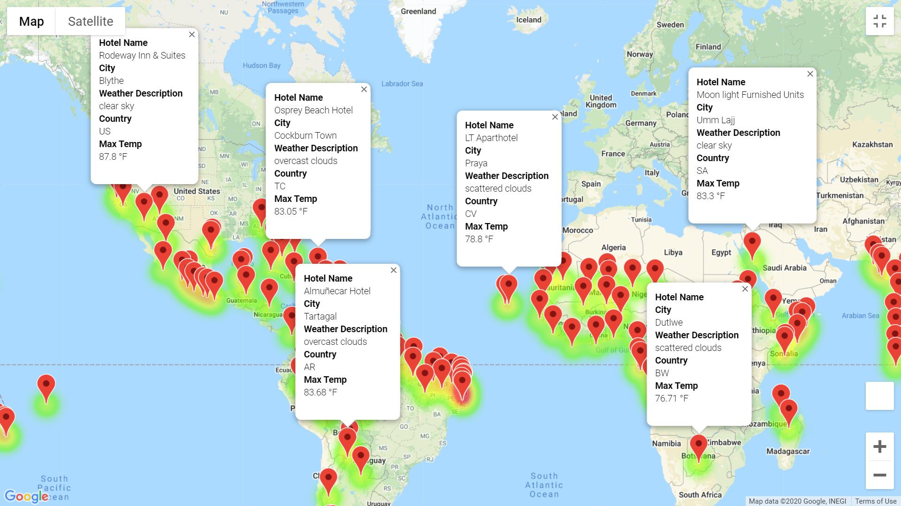
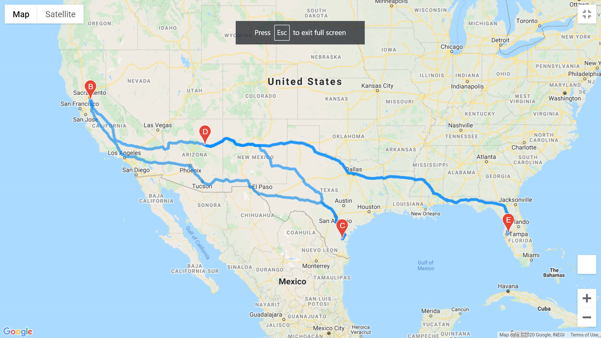
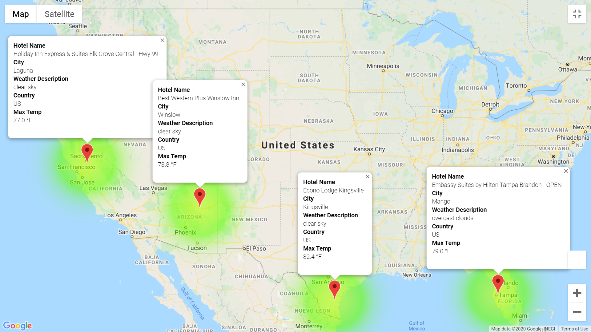

# World_Weather_Analysis

## Background

The development of the new app "PlanMyTrip" was succefful to the partners.

However, some changes have been recommended to make the app more efficient and effective.

The following will be accomplished to take the new app to the next level:
* Adding the weather description to the weather data;
* To enable beta testers use input statements to filter the data for their weather preferences, which will be used to identify potential travel destinations and nearby hotels;
* To enable beta tester to choose four cities to create a travel itinerary;
* Lastly, use Google Maps Directions API, to create a travel route between the four cities as well as a marker layer map.

## Results

The vacation map is generated showing cities with meeting crotical criteria and eabling search from the app.
- Vacation map

The large option provided is to ensure the customer has choice and decide on the approriate accomodation thus the additional need to narrow our code to look for hotels location as below highlighted in the two graphs.

- Travels map

The tourist or any oher visitor can tour the selected cities by car. We managed to select 4 cities in the United States of America (USA) namely Mango,Laguna, Winslow and Kingsville. The circle, as shown in the map, is the itinerrary while driving , to demonstrate the convenience and proximity of the four cities.

After that, a marker is drwn and show describing the four cities and their details in terms of available hotels, country, city, max temperature and the weather description, right on the app. The grap below show the dynamics.

- The Travels map marker

## Conclusion

The app is working and ready to use. It's clearly showing the neccesary information for the beta testers to take it to a test environment before production and go to market process. Additionnal data and arguments will be made, progressively, however the basics is already in place.